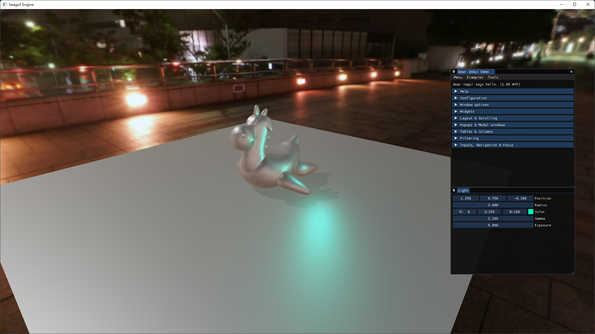
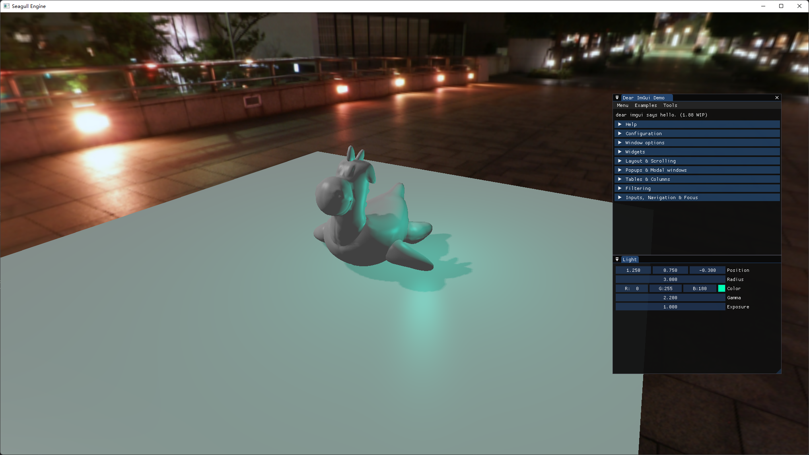
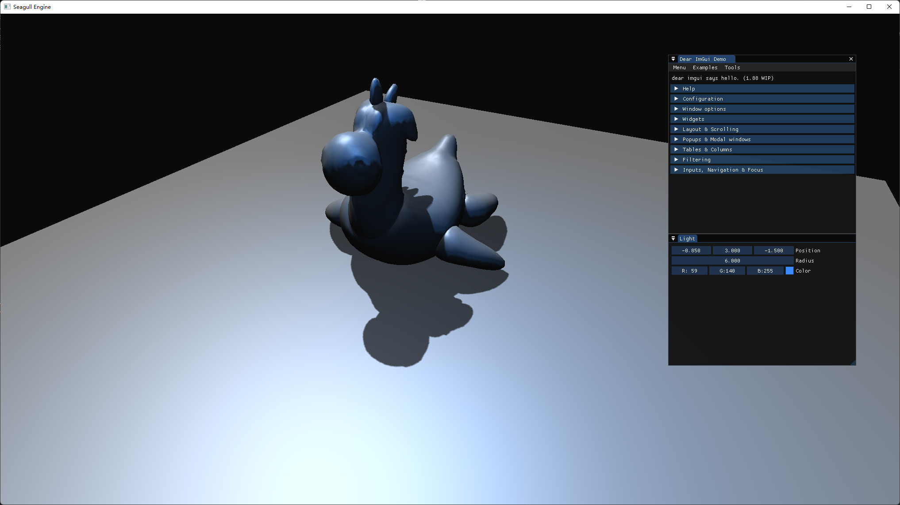

# Seagull-Engine v0.2

## Brief Introduction

**Seagull Engine is a real-time rendering game engine.**  

Still rewriting!!!: A long long way to go./(ㄒoㄒ)/~~

This engine is now in beta version and it is under development.  
If you are interesting in it, you can contact me with these email: 2565492401@qq.com or illmewds@gmail.com.

The graphic language: dx12 and vulkan. (now only has vulkan)  
pc platform: Windows.  

## Developing Screenshots

Default Scene with IBL and BRDF.

Default Scene with phone shading.

Defalut Scene with no skybox.

## Building

Open the Scripts folder, and run the GenerateProject-Win.bat.  
After that, you will see the Seagull.sln in the root directory.  
Open the solution file, build the whole solution and you are ready to go!

## ToDo

- Simple Scripting System (Native Scripting and may be C#)  
- ECS  
- ImGui for Editor  
- Little Particle System  
- PBR Rendering  
- Easy to use Editor  
- 2D Renderer branch for 2D games

Also see ISSUE.md to gain more details.

## Dependencies

If you have got some errors on compiling the shaders, please install VulkanSDK(at least version 1.2 or higher)

Make sure the filepath of the engine have no unicode-included filepath!

## 简介

目前引擎仍然属于最基础的beta阶段，正在努力开发中。  
有兴趣的小伙伴可以用以下邮箱联系我: 2565492401@qq.com 或者 illmewds@gmail.com。

图形编程语言: dx12 和 vulkan。(现在只有vulkan)  
pc平台: Windows。
