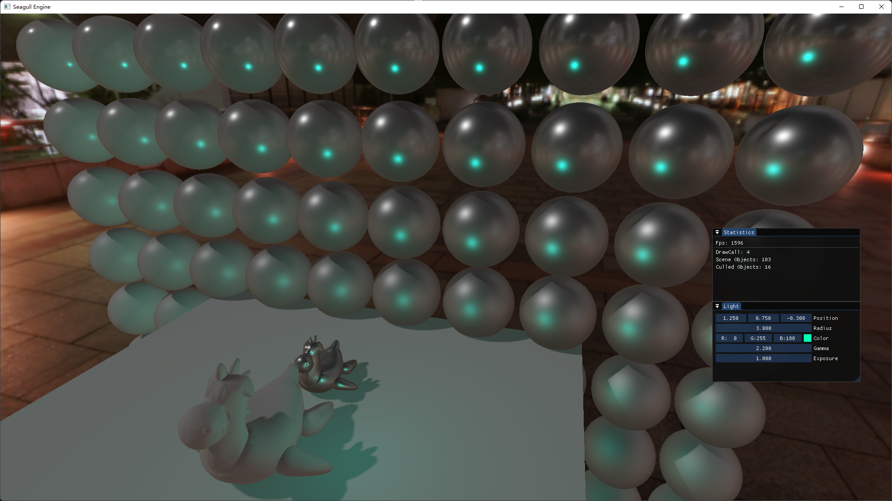
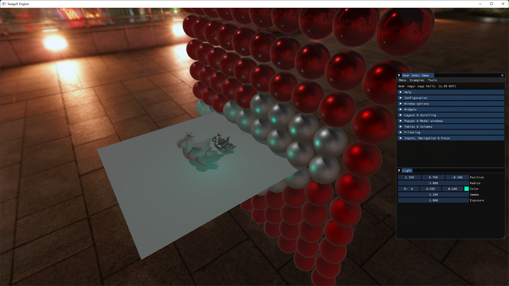

# Seagull Engine v0.2

  

## Brief Introduction

**Seagull Engine is a real-time rendering game engine.**  

Still work in progress!!!: A long long way to go./(ㄒoㄒ)/~~

This engine is for learning purpose, so some parts of the engine may be very coarse.  
This engine is unstable and have many api changing at this stage.  
If you have any questions on this engine, you can contact me with these email: 2565492401@qq.com or illmewds@gmail.com.

**Graphic api**: Vulkan. (may be intergrated dx12 later)  
**Platform**: Windows.  

## Features
- Tiny Self-Implemented ECS  
It is called TipECS and it have the basic subset of a ECS.

- GPU-Driven Rendering Pipeline  
Most of the scene objects(excluding skybox) are culled and drawn by GPU. (Using Draw Indirect and compute shader)

- Auto Shader Recompilation (not the hot reload)  
Automatically detect the modification of the shader and recompile it to SPIR-V shader.

- Simple IBL And PBR Rendering  
Now have brdf implemented. PBR Lighting and PBR camera need to be done later.

- Frame Graph(Or Render Graph) Based Render System  
RenderPasses are constructed into nodes, it is easy to figure out the dependencies between renderpass and easy to do custom rendering.

## Developing Screenshots

Basic editor

GPU Driven Rendering Pipeline  
Inside the small statistics panel you can see the cull out object infos and drawcall infos.

GPU Culling (Red objects been culled out and white objects reserved)

Default Scene with IBL and BRDF.

Default Scene with phone shading.

Defalut Scene with no skybox.

## Building

Open the Scripts folder, and run the GenerateProject-Win.bat.  
After that, you will see the Seagull.sln in the root directory.  
Open the solution file, build the whole solution and you are ready to go!

## ToDo

- Simple Scripting System (Native Scripting and may be C#)  
- ECS  
- ImGui for Editor  
- Little Particle System  
- PBR Rendering  (√)
- Easy to use Editor  
- 2D Renderer branch for 2D branch

Also see ISSUE.md to gain more details.

## Dependencies

For now, no dependencies.
